# OAuth2, JWT, and JWKS: Using Amazon Cognito as IdP

> Originally published on dev.to on 2024-11-27 —
> <https://dev.to/visepol/oauth2-jwt-and-jwks-using-amazon-cognito-as-idp-1jod>
>
> This file is the copy kept in the repository. The images were downloaded and are
> served from `images/`. The text is unchanged, so the `git clone` command still uses
> the account's former name (`vynnux`); the repository now lives at
> <https://github.com/visepol/aws-cognito-w-jwks>.

The amount of interconnected applications on the web has grown significantly over the last decade. With it, the number of threats aimed at fraud or other malicious actions has also increased. OAuth, now in version 2.0, emerges as a protocol to define how these applications should communicate with each other without compromising the security of the transmitted information and ensuring its authenticity.

This article will discuss how this protocol works and how we can implement it modern and securely using JWT tokens and validating with JWKS. The content here can be used as a guide for beginners who have yet to become familiar with the mentioned concepts.


---
## OAuth 2.0


OAuth2 is an authorization protocol that allows third-party applications to access a user's resources without directly exposing their credentials. Instead, OAuth2 uses access tokens, which are limited in scope and time.

✨ OAuth2 defines four actors

 ✳️ **Resource Owner**:     This entity has access rights to the resource, which grants the credentials. It is typically classified as a user.
    
 ✳️ **Resource Server**:     This is the API exposed on the web that contains the user's data. Access to this data is granted through a token issued by the following actor, the Authorization Server.

 ✳️ **Authorization Server**:     Responsible for authentication, it is the one who receives the user's credentials and returns an access token. The tokens issued can be rich, containing information about the Resource Owner, or opaque, provided only as a signed key. This token grants access to the Resource Server.

 ✳️ **Client**:     This is the application that effectively interacts with the Resource Owner, such as a browser or another HTTP client.

This flow demonstrates, in a simplified way, the relationship between the actors involved.

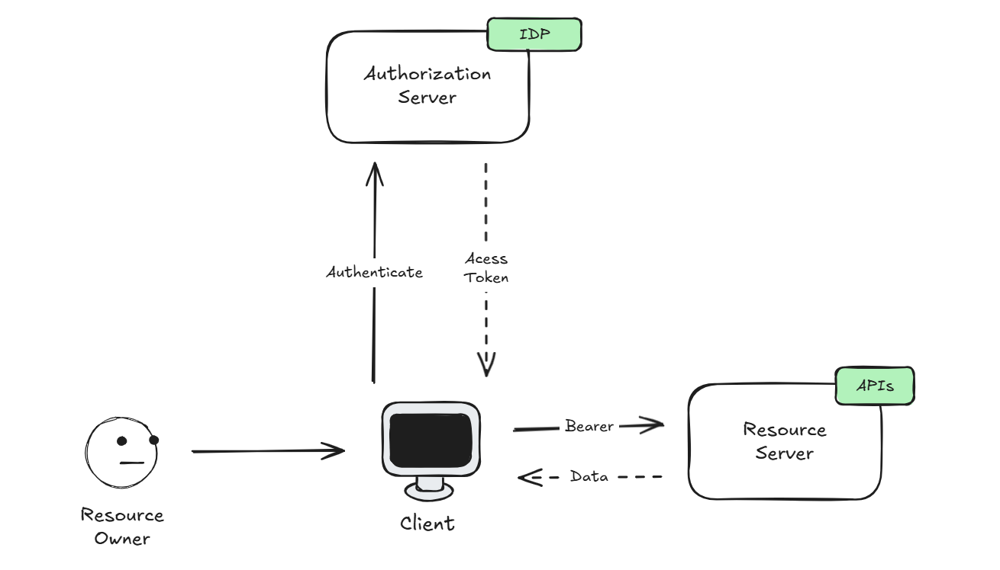

---
## Bearer Token & JWT (JSON Web Token): <br> The Language of Tokens


### Bearer Token
In practical terms, a Bearer Token is the access token issued by the Authorization Server to be sent to the APIs via Header, granting access to the content. The most widely adopted implementation format is JWT. However, the OAuth 2.0 protocol does not mention JWT as a standard. RFC 6750 only specifies the nature of the token as an authentication string but is broad regarding formats and structures.

### JWT 
It is a token standard whose format allows it to be transmitted between two parties. It not only authorizes access to resources but also carries other relevant information through claims. It has a set of rules, both for issuance and validation, that must be followed to comply with the format. This format allows information to be transmitted securely over an insecure channel.

A JWT token follows this format:
> 
🔴eyJhbGciOiJIUzI1NiIsInR5cCI6IkpXVCJ9.
🔵eyJzdWIiOiIxMjM0NTY3ODkwIiwibmFtZSI6IkpvaG4gRG9lIiwiaWF0IjoxNTE2MjM5MDIyfQ.
🟢SflKxwRJSMeKKF2QT4fwpMeJf36POk6yJV_adQssw5c

This sequence is composed of three segments: 
🔴Header, 🔵Payload, and 🟢Signature.

#### Header  
It includes a small JSON that stores data about the token type and the encryption algorithm used.

#### Payload  
Also in JSON, it carries the user's Claims. Claims contain data that the API uses to verify a user's access rights to the resource and, at times, share information with other services and applications.

#### Signature  
The signature is formed by the Header and Payload encoded in Base64. Then, a password is combined using the encryption algorithm specified in the Header, thus forming the final key.

The signature protects the token against malicious changes, ensuring the authenticity of the information being transmitted. Attacks like man-in-the-middle are unable to forge the Claims content, as they do not have the password to generate a new signature.

---
## JWKS (JSON Web Key Set):  <br> Public Key Management


A JWKS is a set of public keys made available through an endpoint of the token issuer itself to validate JWT signatures. When using asymmetric cryptography, meaning a key pair to sign the token instead of a unique secret (symmetric cryptography), only the Authorization Server has access to the private key, and the public keys are shared so that applications can validate whether the token was indeed issued by the Authorization Server.

Take a look at an example:
```json
{
    "keys": [
        {
            "kty": "RSA",
            "e": "AQAB",
            "use": "sig",
            "kid": "ca761cd3-8092-46be-926b-ef28465ff942",
            "n": "oXAP360uf_9_KXTCk6BiQOgwQJlqoycCbsukFtoUCmn57jM-9n2uqBBPT_8VnTIaYr4h8zxMy8HRkdX35HRmZANoqekhH03hhMc69mK4yEYZwBNyV9SteXrF5hfj4SWsK0t3CZ_G_U303XLj7ak5m-4w1UXCmvBERR_SwXjLOKwAAFlOQS_0sAB9yzvJkvsuvqd4lA3-vFFF_ZVbTHuJAznqB_avwCbCHJWfiWln2PN7LsieX08tE13bPP1TVEFid9mcUz5dwz0J9QKTYCd90fkyzqanzG638SFoyL84ddmD_9pef5x03oMWEU9-dxEI6PFfWEQmXN1eg7GfJI6bxQ"
        }
    ]
}

```
One of the fields is ***kid***, which is a key identifier, also present in the JWT header. It is through this identifier that we know which key in the JWKS set will be used to validate the signature of our token.

---
## AWS Cognito: Identity Provider


Cognito is an AWS service that manages identity and access. It acts as a user directory, capable of storing and validating data, authenticating access, and securely providing identity. We can store fields such as email, name, phone, birthdate, nickname, gender, or any other information through custom attributes. In addition, Cogito offers multiple ways to log in to the same resource.

### Demo with JWKS
Let's break down a TypeScript project that implements the OAuth 2.0 solution using Cognito as the identity provider. The goal here will be to retrieve an access token using the credentials provided by an HTTP Client and validate the token's signature against a JWKS keychain.

### User Pool Creation
First, we need to configure our provider. Access the AWS Management Console and search for Cognito. Navigate to the service and look for the **Create user pool** option. There are a total of 6 steps, the last one being a review of the options selected before creating the user pool. I will display my final step, highlighting the selected options and emphasizing what is relevant to the demonstration.

#### Sign-in experience:
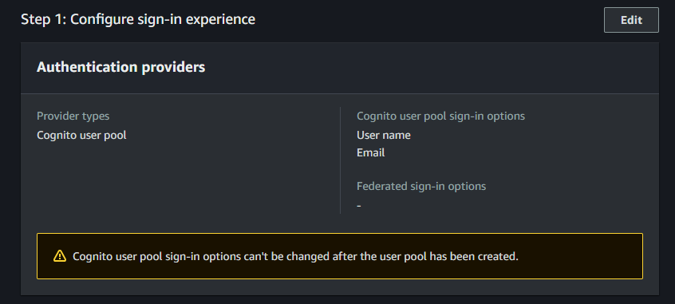
-   User name is enabled as a login option.
-   Email is enabled as a login option.

#### Security requirements:
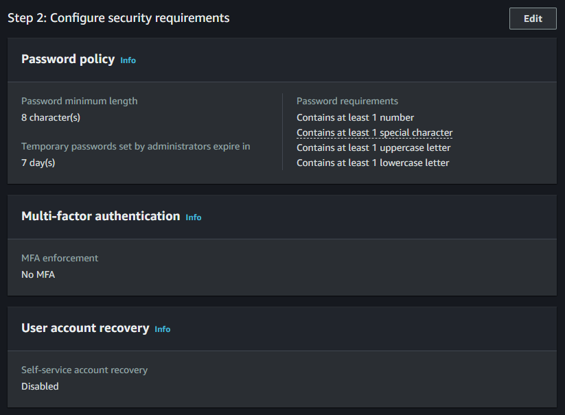
-   I used Cognito's default policy for user password definition.
-   MFA is disabled.
-   Self-service account recovery option is disabled.

#### Sign-up experience:
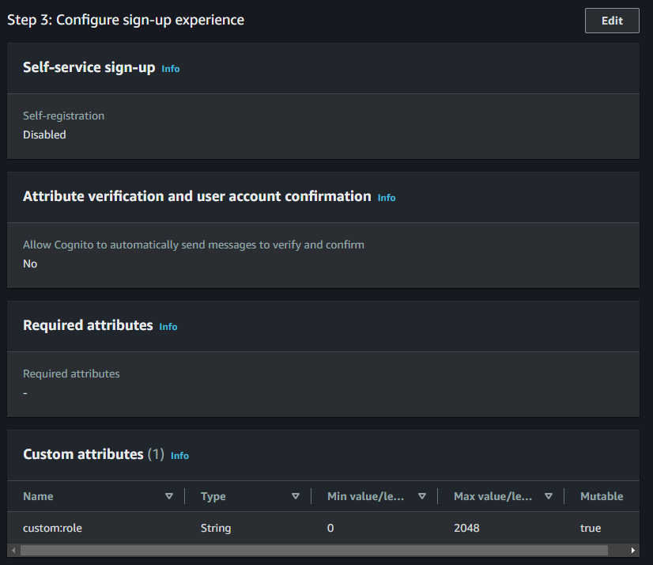
-   Self-registration is disabled, users will be created directly in the console for demo purposes.
-   None of the default attributes are mandatory.

#### Message delivery:
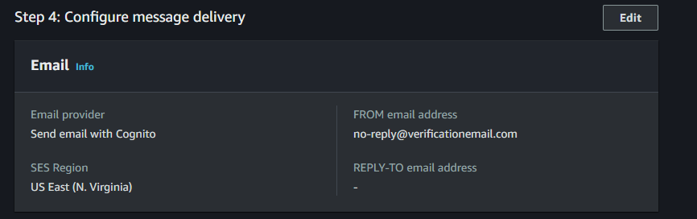
-   I am not using SES for sending emails.
-   I am not using SNS to send any type of notification.
-   I selected the option Send email with Cognito.

#### Integrate your app:
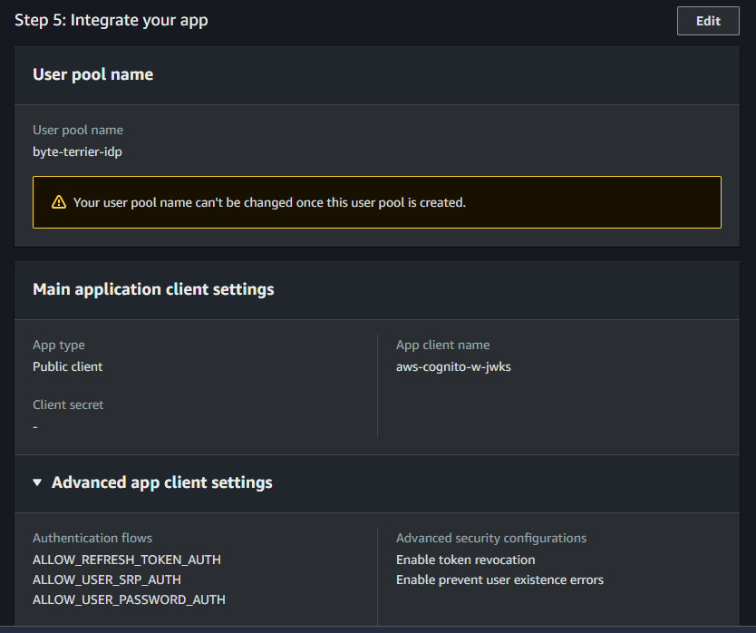
-   I added the following authentication flows: **ALLOW_REFRESH_TOKEN_AUTH**, **ALLOW_USER_SRP_AUTH** and **ALLOW_USER_PASSWORD_AUTH**
-   My User pool name will be byte-terrier-idp
-   My App type will be Public client
-   And finally, My App client name will be aws-cognito-w-jwks

With everything set up, access: _`cognito -> user pools -> “the-pool-created”`_
Now, you should see a screen similar to this:

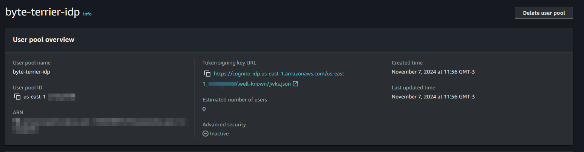
Take note of two items from the screen, as these values will be used later in the demo.
-   User pool ID, It is the identifier of your pool.
-   Token signing key URL, this is the JWKS endpoint where the set of public keys for validation will be available.

### User Creation
Still in the created pool, look for the **Create user** option. A new page should appear. Once again, I have listed the options that should be selected.

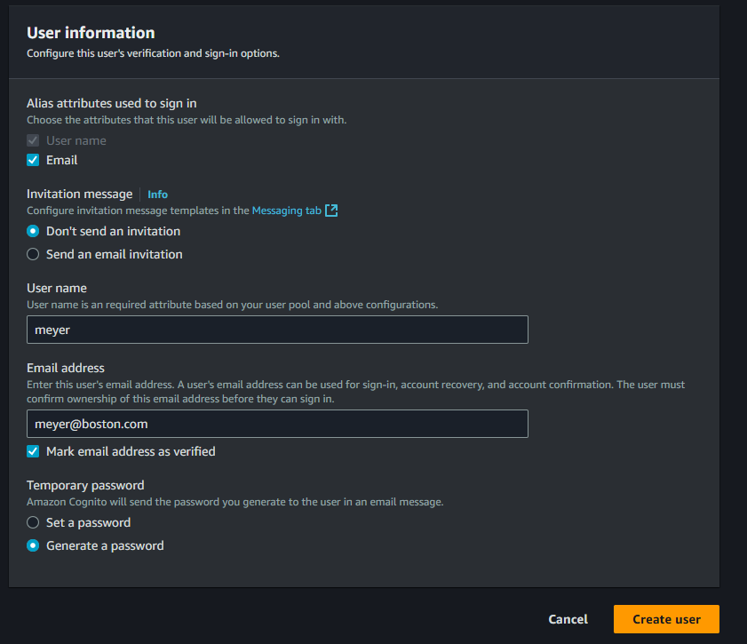
-   The user will be able to log in with either the Username or the Email.
-   The user will not receive any type of invitation.
-   The username will be Meyer (it's the name of my dog).
-   The email will be meyer@boston.com
-   A temporary password will be created.

Click on **Create user**. A new user will be created but with the status **Force change password**. Since the goal here is only to perform a demo and not an end-to-end implementation, I will force the user's password through CLI. I am assuming that your AWS credentials are correctly configured in the environment.

Check at: _`~/.aws/credentials`_
If they are not, here’s how to set them up: [Configuring AWS CLI Credentials](https://docs.aws.amazon.com/pt_br/cli/latest/userguide/cli-chap-configure.html)

Run the following command, making the necessary replacements.
```bash
aws cognito-idp admin-set-user-password --user-pool-id '<your-user-pool-id>' --username '<your-username>' --password '<your-new-password>' --permanent
```
Example:
```bash
aws cognito-idp admin-set-user-password --user-pool-id 'us-east-1_ErtWYLogU' --username 'meyer' --password 't!)l5T$C825l' --permanent
```
This should change the user's status to **Confirmed.**

### App Client
Finally, go to: _`App integration -> App client list`_
...and find the app's Client. This ID will be needed for integration between the AWS SDK and Cognito.

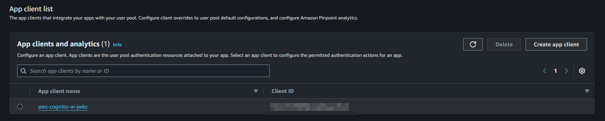

---
## A look at the code


I created a simple HTTP API in TypeScript for us to dissect and analyze how the integration with Cognito works using the AWS SDK. For better tracking, you might want to clone the repository to your machine, which can be done using the following command

```bash
git clone git@github.com:vynnux/aws-cognito-w-jwks.git
```
Here is the directory structure:
```
/aws-cognito-w-jwks
├── .env.example
├── .gitignore
├── package-lock.json
├── package.json
├── request.http
└── src
	├── app.ts
	├── server.ts
	├── http
	│ ├── _routes.ts
	│ ├── authenticate.controller.ts
	│ └── verify-jwt.controller.ts
	└── lib
		├── cognito.ts
		└── jwks.ts
```

### Running the server

To start the project we must define the environment variables. Create a new file named `.env` based on `.env.example` and set the values according to what is shown in your user pool. 

Here is a description of each one for better understanding:  
  
- **`COGNITO_CLIENT_ID`** - This is the Application's Client ID, which can be found in the App client list. It should be unique for each application, for better management.
- **`AWS_REGION`** - This is the region where the user pool that was created is located.
- **`JWKS_URI`** - This is the JWKS endpoint for querying public keys. It appears in the main dashboard of the User Pool.  
- **`DEBUG`** *(optional)* - When set to the value - jwks, it increases verbosity for the jwks-rsa dependency, which we use to validate the token signature.

---

Moving on… Now, we need to install the project dependencies. Run **npm** to download the packages.
```bash
npm i
```
Once completed, we are ready to start our server, which will listen on port **3000**. Run...
```bash
npm start
```
If everything goes well, your output should be:
```bash
🍃 HTTTP Server Running.
```

### Analysis
There’s no reason to cover the entire code in this article; in short, it’s an API built with Fastify. Both controllers perform some processing and validation before actually executing their actions. Feel free to take a look at the other files, but here, we will focus on `cognito.ts` and `jwks.ts` under the lib folder.  

#### cognito.ts
The `/authenticate` route is responsible for generating the JWT token. This is where the user credentials are passed via the _POST_ method. If we open the `request.http` file, located at the root of the project, we will see… 

```bash
POST http://localhost:3000/authenticate HTTP/1.1
content-type: application/json

{
"username": "meyer",
"password": "t!)l5T$C825l"
}
```
This request should return the following response:

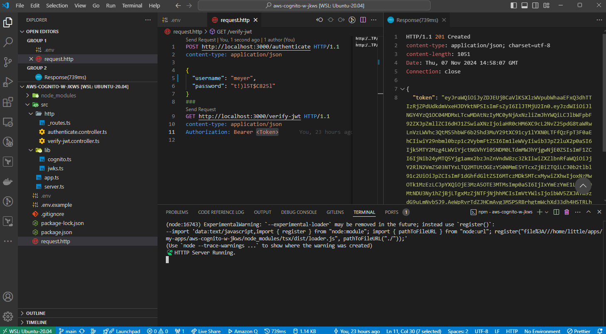
In username field, we must pass the username that was registered. The interesting thing here is that, as mentioned previously, Cognito supports several login methods, and one of the methods we enabled was via email. Therefore, we could log in as the same user using a different credential, in this case, meyer@boston.com.

As for the password, we must pass the permanent password that we set for the user, the one we defined using the AWS CLI.

The code ([on Github](https://github.com/visepol/aws-cognito-w-jwks/blob/main/src/lib/cognito.ts)):
```typescript
import {
  CognitoIdentityProviderClient,
  InitiateAuthCommand,
  InitiateAuthCommandInput,
} from '@aws-sdk/client-cognito-identity-provider'

const AWS_REGION = process.env.AWS_REGION || 'us-east-1'
const COGNITO_CLIENT_ID = process.env.COGNITO_CLIENT_ID || ''

const cognitoClient = new CognitoIdentityProviderClient({
  region: AWS_REGION,
})

/**
 * Get a JWT token from Cognito using the USER_PASSWORD_AUTH flow
 * @param {string} username - The login credential of the user
 * @param {string} password - The password credential of the user
 * @returns {Promise<string | undefined>} - The JWT Token
 */
export async function getJwtToken(
  username: string,
  password: string,
): Promise<string | undefined> {
  const params: InitiateAuthCommandInput = {
    AuthFlow: 'USER_PASSWORD_AUTH',
    ClientId: COGNITO_CLIENT_ID,
    AuthParameters: {
      USERNAME: username,
      PASSWORD: password,
    },
  }

  const command = new InitiateAuthCommand(params)
  const response = await cognitoClient.send(command)

  return response.AuthenticationResult?.IdToken
}
```
When we make the request, the data is delivered to the `getJwtToken` function (line 20), which in turn initializes an AWS Client to interact with our IdP (Cognito). We tell the Client that the authentication flow to be used will be `USER_PASSWORD_AUTH` (line 25), meaning authentication via username and password. If the authentication is successful, the token is returned. Otherwise, the controller will set the HTTP status 401, which is unauthorized access.

#### jwks.ts
The `/verify-jwt` route (*GET*) is responsible for validating the signature of our token. We must add a header - *Authorization* - with the value Bearer + jwt. The controller will sanitize the token, removing the Bearer prefix before invoking the `validateTokenSignature` method in the `jwks.ts` file.

The full request looks like this:
```bash
GET http://localhost:3000/verify-jwt HTTP/1.1
content-type: application/json

Authorization: Bearer eyJra...
```
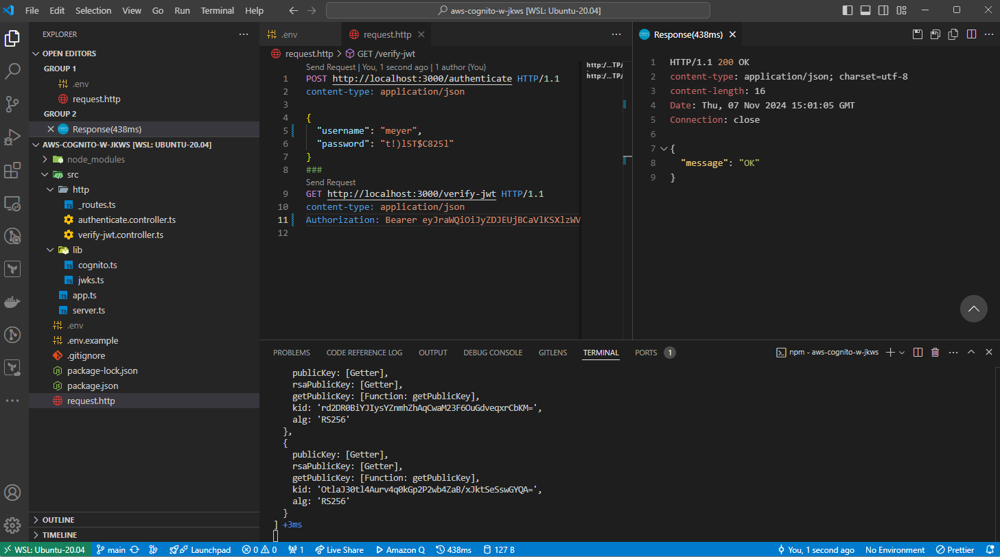

The code ([on Github](https://github.com/visepol/aws-cognito-w-jwks/blob/main/src/lib/jwks.ts)):
```typescript
import jwt from 'jsonwebtoken'
import jwksClient from 'jwks-rsa'

const JWKS_URI = process.env.JWKS_URI || ''

export class JWKSValidationError extends Error {
  constructor() {
    super('JWKSValidationError')
  }
}

/**
 * Validate the signature of a JWT Token against the JWKS URI
 * @param {string} token - The JWT Token to verify
 * @returns {Promise<void>} - Promise that resolves if the token is valid
 */
export async function validateTokenSignature(token: string): Promise<void> {
  const client = jwksClient({
    jwksUri: JWKS_URI,
  })

  const header = jwt.decode(token, {
    complete: true,
  })?.header
  if (!header) throw new JWKSValidationError()

  const signingKey = await client.getSigningKey(header.kid)
  if (!signingKey) throw new JWKSValidationError()

  await new Promise((resolve, reject) => {
    jwt.verify(
      token,
      signingKey.getPublicKey(),
      { algorithms: ['RS256'] },
      (err, decoded) => {
        if (err) reject(err)
        resolve(decoded)
      },
    )
  })
}
```
In `jwks.ts`, on line 18, a JWKS Client is created to fetch the JSON containing the collection of public keys. On line 22, we decode the token to extract its header and locate the ***kid***, which is the key ID we need to match. On line 27, we search for the key in the set. Finally, on line 30, we create a promise and use `jwt.verify` to verify the signature of the keys. The key will be decrypted using the RS256 algorithm and its content must be exactly a base64 of the Header + Payload.


> ℹ️ _This is why every JWT starts with ey, it is the encoding of {", the beginning of a JSON structure in base64._


If something goes wrong, anything at all, an exception will be thrown, and the controller will reject access to the resource, not displaying the expected response — ***HTTP 200 OK***.

---
## Final Considerations


This article covered concepts that promote greater care and security for our user's data. We applied these concepts to one of AWS's services, Cognito, which offers several other strategies beyond the one discussed - such as MFA or SSO. These practices should help prevent malicious attacks and minimize the risk of fraud, as well as being an efficient way to ensure granular access control for your users.

For more information about Cognito, [see the official documentation](https://docs.aws.amazon.com/cognito/latest/developerguide/cognito-user-pools.html).

### References:
https://docs.aws.amazon.com/cognito/latest/developerguide/what-is-amazon-cognito.html
https://jwt.io/introduction/
https://datatracker.ietf.org/doc/html/rfc6750
https://datatracker.ietf.org/doc/html/rfc6749
https://datatracker.ietf.org/doc/html/rfc7519